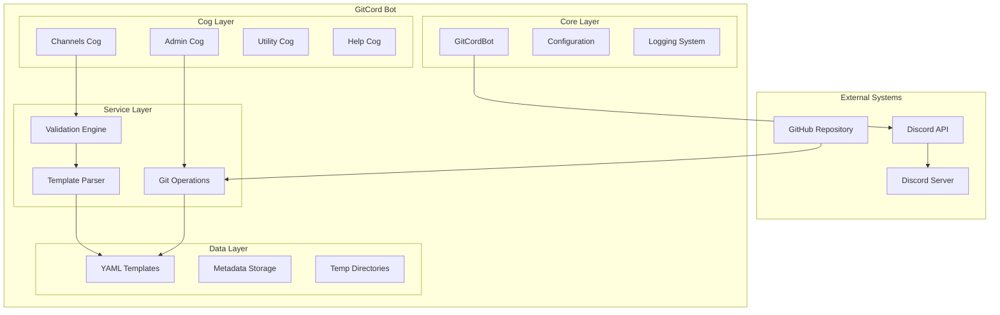

# GitCord Design Document

## Overview

GitCord is a Discord bot that implements GitOps principles for Discord server management. The system enables server administrators to define their Discord server structure using YAML configuration files, version control these configurations with Git, and automatically apply them to Discord servers. The architecture follows a modular, event-driven design using Discord.py's cog system for extensibility and maintainability.

The bot operates as a bridge between Git repositories containing YAML templates and Discord's API, providing both manual command-driven operations and planned automatic synchronization capabilities.

## Architecture

### High-Level Architecture



### Component Architecture

The system follows a layered architecture with clear separation of concerns:

1. **Presentation Layer**: Discord command interfaces (slash and prefix commands)
2. **Business Logic Layer**: Cogs containing domain-specific functionality
3. **Service Layer**: Utilities for template processing, validation, and Git operations
4. **Data Layer**: YAML template storage and metadata management

## Components and Interfaces

### Core Components

#### GitCordBot (Main Bot Class)
- **Purpose**: Central bot instance managing Discord connection and cog lifecycle
- **Key Responsibilities**:
  - Discord client initialization with proper intents
  - Cog loading and management
  - Global error handling
  - Command synchronization coordination
- **Interfaces**:
  - Inherits from `discord.ext.commands.Bot`
  - Implements setup hooks for initialization
  - Provides error handling callbacks

#### Configuration System
- **Purpose**: Environment-based configuration management
- **Key Responsibilities**:
  - Discord token management
  - Bot prefix configuration
  - Activity status configuration
  - Environment variable loading
- **Interfaces**:
  - Property-based access to configuration values
  - Environment variable fallbacks
  - Validation of required configuration

#### Event Handler
- **Purpose**: Discord event processing and bot lifecycle management
- **Key Responsibilities**:
  - Bot ready event handling
  - Command synchronization
  - Restart message broadcasting
- **Interfaces**:
  - Discord.py event decorators
  - Async event handlers

### Business Logic Components (Cogs)

#### Admin Cog
- **Purpose**: Administrative operations and Git integration
- **Key Responsibilities**:
  - Command synchronization management
  - Git repository cloning and pulling
  - Template application from repositories
  - Administrative permission enforcement
- **Interfaces**:
  - Slash commands: `/synccommands`, `/applytemplate`
  - Prefix commands: `!synccommands`, `!git`, `!applytemplate`
  - Git subprocess operations
  - GitHub API integration for repository access

#### Channels Cog
- **Purpose**: Discord channel and category management
- **Key Responsibilities**:
  - Single channel creation from YAML templates
  - Category creation with multiple channels
  - Existing channel updates and synchronization
  - Permission validation for channel operations
- **Interfaces**:
  - Slash commands: `/createcategory`
  - Prefix commands: `!createchannel`, `!createcategory`
  - Discord API channel management
  - YAML template processing

#### Utility Cog
- **Purpose**: General utility commands and bot health checks
- **Key Responsibilities**:
  - Bot latency monitoring
  - Basic interaction commands
  - Health check endpoints
- **Interfaces**:
  - Slash commands: `/slashping`
  - Prefix commands: `!hello`, `!ping`

#### Help Cog
- **Purpose**: User assistance and documentation access
- **Key Responsibilities**:
  - Command documentation display
  - Link to external documentation
  - Usage examples and guidance
- **Interfaces**:
  - Slash commands: `/help`
  - Prefix commands: `!help`

### Service Layer Components

#### Template Parser
- **Purpose**: YAML template processing and validation
- **Key Responsibilities**:
  - YAML syntax validation
  - Template schema validation
  - Configuration object creation
  - Error reporting with specific details
- **Interfaces**:
  - `parse_channel_config(yaml_path)` → Channel configuration
  - `parse_category_config(yaml_path)` → Category configuration
  - `parse_*_config_from_str(yaml_str)` → Configuration from string

#### Git Operations Service
- **Purpose**: Git repository management and synchronization
- **Key Responsibilities**:
  - Repository cloning with branch support
  - Repository updates via git pull
  - GitHub URL parsing and validation
  - Local repository management
- **Interfaces**:
  - Subprocess-based git operations
  - Repository URL validation
  - Branch specification support
  - Error handling for git failures

#### Validation Engine
- **Purpose**: Input validation and security enforcement
- **Key Responsibilities**:
  - YAML template validation
  - Discord permission checking
  - Input sanitization
  - Security constraint enforcement
- **Interfaces**:
  - Template validation functions
  - Permission decorators
  - Input sanitization utilities

#### Discord API Abstraction
- **Purpose**: Discord API interaction management
- **Key Responsibilities**:
  - Channel creation by type (text, voice, category)
  - Channel property updates
  - Permission management
  - Rate limiting handling
- **Interfaces**:
  - `create_channel_by_type()` → Discord channel objects
  - `create_channel_kwargs()` → Discord API parameters
  - Channel existence checking
  - Bulk operation support

### Data Layer Components

#### YAML Template Storage
- **Purpose**: Template file management and organization
- **Key Responsibilities**:
  - Template file storage in organized directory structures
  - Template metadata tracking
  - File system operations
- **Interfaces**:
  - File system paths for templates
  - Template directory organization
  - Metadata file management

#### Metadata Management
- **Purpose**: Bot operation state and template tracking
- **Key Responsibilities**:
  - Guild-specific metadata storage
  - Template application history
  - Repository synchronization state
- **Interfaces**:
  - JSON-based metadata storage
  - Guild-scoped metadata operations
  - Template source tracking

## Data Models

### Template Models

#### Channel Template
```yaml
name: string          # Required: Channel name
type: string          # Required: "text" | "voice" | "category"
topic: string         # Optional: Channel topic/description
position: integer     # Required: Channel position in list
nsfw: boolean         # Optional: NSFW flag for text channels
user_limit: integer   # Optional: User limit for voice channels
```

#### Category Template
```yaml
name: string          # Required: Category name
type: "category"      # Required: Must be "category"
position: integer     # Required: Category position
channels: array       # Required: Array of channel names to include
```

### Internal Data Models

#### CategoryResult
```python
@dataclass
class CategoryResult:
    category: Optional[discord.CategoryChannel]
    created_channels: list[discord.abc.GuildChannel]
    updated_channels: list[discord.abc.GuildChannel]
    skipped_channels: list[str]
    extra_channels: list[discord.abc.GuildChannel]
    is_update: bool
```

#### Configuration Model
```python
class Config:
    token: str           # Discord bot token
    prefix: str          # Command prefix (default: "!")
    activity_name: str   # Bot activity display name
```

## Error Handling

### Error Categories

#### Template Errors
- **YAML Syntax Errors**: Invalid YAML formatting with line-specific feedback
- **Schema Validation Errors**: Missing required fields or invalid field values
- **Reference Errors**: Non-existent channel references in category templates
- **File System Errors**: Missing template files or permission issues

#### Discord API Errors
- **Permission Errors**: Insufficient bot or user permissions
- **Rate Limiting**: Discord API rate limit handling with exponential backoff
- **Channel Conflicts**: Existing channels with conflicting names or properties
- **Guild Limitations**: Discord server limits (channel count, category limits)

#### Git Operation Errors
- **Repository Access**: Invalid URLs, private repositories, network issues
- **Git Command Failures**: Clone failures, pull conflicts, branch issues
- **File System Errors**: Disk space, permissions, path issues

### Error Handling Strategy

#### Graceful Degradation
- Continue processing remaining operations when individual items fail
- Provide comprehensive error summaries for batch operations
- Maintain system stability during partial failures

#### User Feedback
- Clear, actionable error messages with specific problem descriptions
- Suggested solutions for common error scenarios
- Progress indicators for long-running operations

#### Logging and Monitoring
- Structured logging with appropriate log levels
- Error context preservation for debugging
- Performance metrics for operation monitoring

## Testing Strategy

### Unit Testing
- **Template Parser Testing**: YAML validation, schema compliance, error cases
- **Discord API Abstraction**: Mock Discord objects for channel operations
- **Configuration Management**: Environment variable handling, validation
- **Utility Functions**: Helper function correctness and edge cases

### Integration Testing
- **Cog Integration**: Command execution flows, permission checking
- **Discord API Integration**: Real Discord server testing in development environment
- **Git Operations**: Repository cloning, pulling, error handling
- **End-to-End Workflows**: Complete template application processes

### Test Data Management
- **Template Fixtures**: Valid and invalid YAML templates for testing
- **Mock Discord Objects**: Simulated Discord servers, channels, users
- **Test Repositories**: Git repositories with various template structures
- **Configuration Scenarios**: Different environment configurations

### Testing Infrastructure
- **Pytest Framework**: Python testing with async support
- **Discord.py Testing**: Mock Discord client and objects
- **Temporary Directories**: Isolated file system operations
- **Environment Isolation**: Test-specific configuration management

## Security Considerations

### Input Validation
- **YAML Parsing**: Safe YAML loading to prevent code injection
- **URL Validation**: GitHub URL parsing and validation
- **File Path Sanitization**: Prevent directory traversal attacks
- **Command Parameter Validation**: Input sanitization for all commands

### Permission Management
- **Discord Permissions**: Proper permission checking before operations
- **Administrative Commands**: Restricted access to sensitive operations
- **Guild Isolation**: Operations scoped to specific Discord servers
- **User Authorization**: Command-level permission enforcement

### Data Security
- **Token Management**: Secure Discord token handling
- **Temporary Files**: Secure cleanup of temporary directories
- **Metadata Protection**: Guild-specific data isolation
- **Logging Security**: No sensitive data in logs

### Network Security
- **HTTPS Enforcement**: Secure connections for Git operations
- **Repository Validation**: GitHub URL validation and sanitization
- **Rate Limiting**: Respect Discord API rate limits
- **Error Information**: Limit error details to prevent information disclosure

## Performance Considerations

### Scalability
- **Concurrent Operations**: Async/await for non-blocking operations
- **Batch Processing**: Efficient bulk channel operations
- **Memory Management**: Proper cleanup of temporary resources
- **Connection Pooling**: Efficient Discord API connection usage

### Optimization
- **Caching**: Template parsing results caching
- **Lazy Loading**: On-demand cog and resource loading
- **Efficient Queries**: Minimize Discord API calls
- **Resource Cleanup**: Proper disposal of temporary files and connections

### Monitoring
- **Performance Metrics**: Operation timing and success rates
- **Resource Usage**: Memory and disk space monitoring
- **API Usage**: Discord API rate limit monitoring
- **Error Rates**: Error frequency and pattern analysis